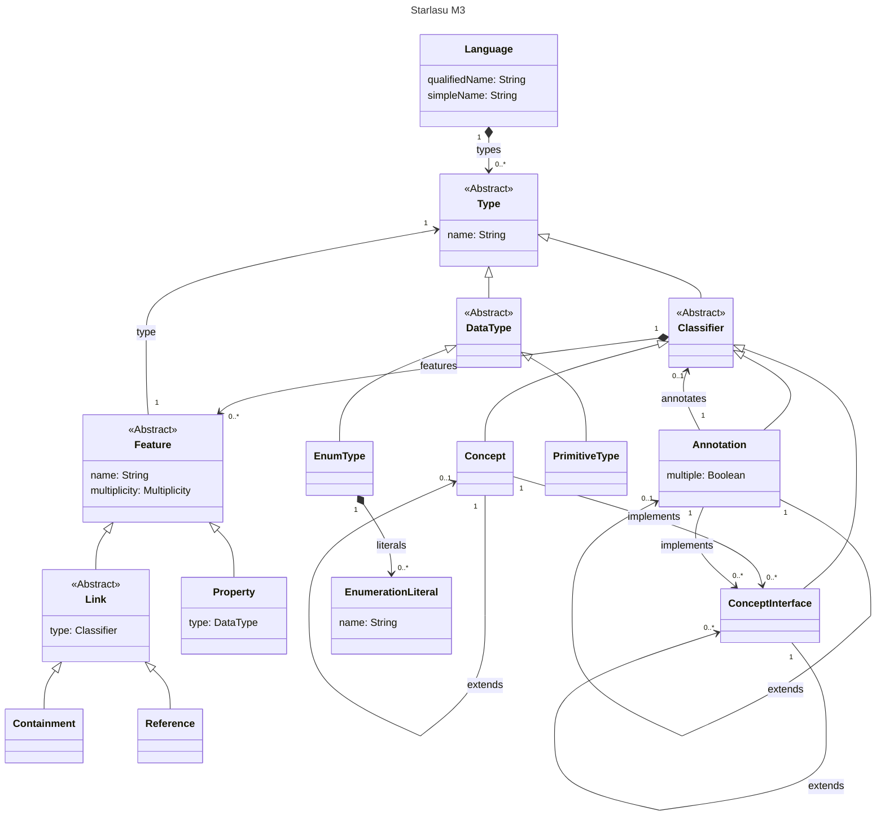

# AST Representation

Starlasu operates on Abstract Syntax Trees (ASTs) (or _Code Models_). These are tree-like data structures to represent 
the information contained in a piece of formal language or "code". For example, the statements in a procedural program, 
the data elements in a SQL query, or the steps in a business workflow.

All the Starlasu ASTs are based on a few primitive elements.

The structure is similar to the one used by other Modeling solutions such as [EMF](https://eclipse.dev/modeling/emf/), 
[MPS](https://www.jetbrains.com/mps/), or [LionWeb](https://lionweb.io/). 
In particular we aim to (mostly) converge to the same terminology used in LionWeb 
(see the [LioWeb's specifications](https://lionweb.io/specification/metametamodel/metametamodel.html)).

This is a representation of the whole structure.

The AST representation in Starlasu follows a hierarchical structure where:

- **Language**: The top-level container that holds all types
- **Type**: Abstract base for all types in the language
- **Classifier**: Abstract base for concepts, interfaces, and annotations
- **Concept**: Concrete classes that can extend other concepts and implement interfaces
- **Feature**: Properties and links that define the structure of classifiers
- **DataType**: Primitive types and enums for basic values

This structure provides a flexible foundation for representing any formal language or code structure while maintaining consistency across different Starlasu implementations. 